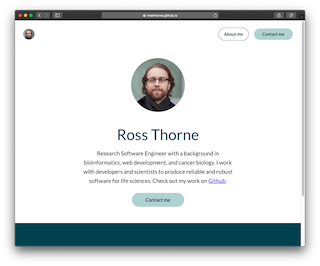

<h1 align="center">
  Portfolio Website
</h1>


<p align="center">
  
</p>

<p align="center">
  <a href="http://rmwthorne.github.io/">View Live</a>
</p>

Portfolio website, built on the generous work of [LekovicMilos/gatsby-starter-portfolio](https://www.gatsbyjs.org/starters/LekovicMilos/gatsby-starter-portfolio/), with many thanks.

## Setup

1.  **Install dependencies**

    ```sh
    cd rmwthorne.github.io/
    nvm use 10
    npm install
    ```

2.  **Development**

    ```sh
    gatsby develop
    ```

    This will run a devlopment server at `http://localhost:8000`.

3.  **Deployment**

    Deployment is handled by the github actions in `.github/workflows/main.yml`. Pushes to `dev` cause the files to be built on `master`.
